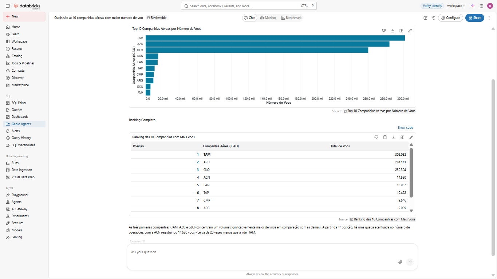
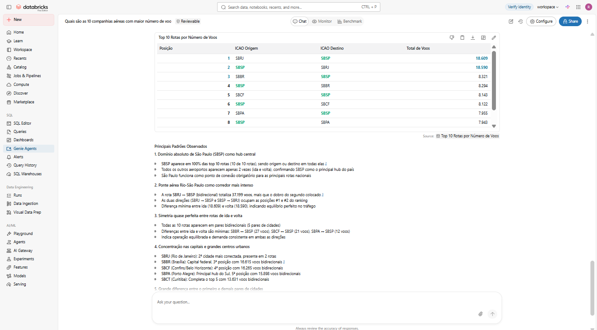
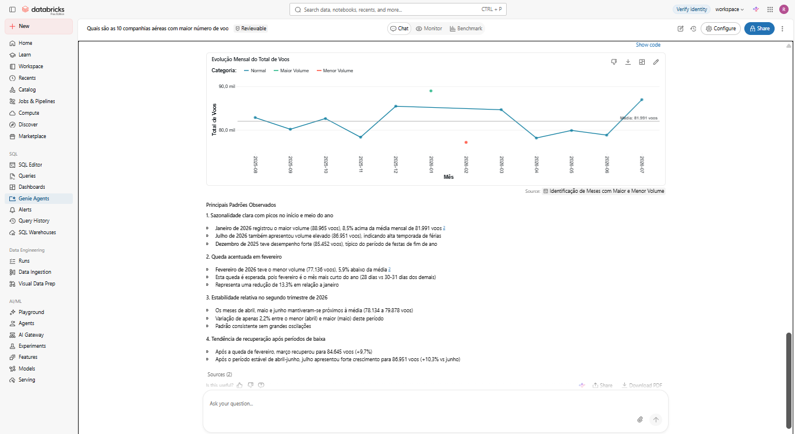

# ✈️ VoeBem Analytics AI

Projeto de Engenharia de Dados desenvolvido no **Databricks** para processamento e análise de dados públicos da aviação brasileira disponibilizados pela **ANAC**.

A solução implementa uma arquitetura **Medallion (Bronze, Silver e Gold)** utilizando PySpark, Delta Lake e Unity Catalog para transformar os arquivos de origem em dados estruturados e indicadores analíticos.

Na etapa final, as tabelas analíticas são disponibilizadas ao **Databricks Genie**, permitindo explorar os dados por meio de perguntas em linguagem natural.

---

## 🎯 Objetivo

O objetivo do projeto é construir um fluxo completo de dados, partindo da ingestão dos arquivos da ANAC até a disponibilização de informações prontas para análise.

O pipeline foi desenvolvido para permitir análises relacionadas a:

- volume de voos por companhia aérea;
- rotas com maior movimentação;
- aeroportos com maior número de partidas;
- atrasos médios de partida e chegada;
- percentual de voos com atraso superior a 15 minutos;
- evolução mensal do volume de voos.

Além das consultas tradicionais, o projeto utiliza Inteligência Artificial para permitir que essas informações sejam exploradas utilizando linguagem natural.

---

## 🏗️ Arquitetura

Os dados percorrem três etapas de processamento antes de serem disponibilizados para análise.

```text
                Dados ANAC
                    │
                    ▼
             ┌──────────────┐
             │    BRONZE    │
             │              │
             │   Ingestão   │
             └──────┬───────┘
                    │
                    ▼
             ┌──────────────┐
             │    SILVER    │
             │              │
             │ Tratamento   │
             └──────┬───────┘
                    │
                    ▼
             ┌──────────────┐
             │     GOLD     │
             │              │
             │ KPIs         │
             └──────┬───────┘
                    │
                    ▼
             ┌──────────────┐
             │    GENIE     │
             │              │
             │ Linguagem    │
             │ natural      │
             └──────────────┘
```

Cada camada possui uma responsabilidade específica, evitando misturar ingestão, tratamento e regras analíticas em uma única etapa.

---

## 🥉 Bronze — Ingestão

A Bronze representa o primeiro contato dos dados da ANAC com o pipeline.

Os arquivos CSV são carregados utilizando **PySpark** e armazenados como tabelas Delta. Nessa etapa, o objetivo principal é preservar os dados recebidos e organizá-los para os processamentos seguintes.

Também foram adicionadas informações de auditoria, permitindo identificar o arquivo de origem e o momento em que os dados foram ingeridos.

### Dados carregados

O projeto trabalha com o conjunto principal de voos VRA e com arquivos auxiliares utilizados como referência:

```text
voebem.bronze.vra
voebem.bronze.aerodromos
voebem.bronze.empresas_nacionais
voebem.bronze.empresas_estrangeiras
voebem.bronze.codigos_operacao
```

Entre as informações adicionadas para auditoria estão:

```text
_arquivo_origem
_ingerido_em
```

### Notebooks

```text
bronze_vra
bronze_referencias
```

---

## 🥈 Silver — Tratamento

Na Silver, os dados deixam de ser apenas registros ingeridos e passam a ser preparados para utilização analítica.

Os campos de data e hora são convertidos para tipos adequados, permitindo realizar operações temporais que não seriam confiáveis enquanto os valores permanecessem como texto.

A partir dos horários previstos e realizados, foram criadas duas métricas importantes:

```text
atraso_partida_min
atraso_chegada_min
```

Essas colunas representam a diferença, em minutos, entre o horário previsto e o horário efetivamente registrado.

Ao final do processamento, os dados tratados são persistidos em:

```text
voebem.silver.vra
```

A tabela persistida também é recarregada para validar se o resultado armazenado corresponde ao DataFrame produzido durante a transformação.

### Notebook

```text
silver_vra
```

---

## 🥇 Gold — Camada Analítica

A Gold transforma os registros individuais de voos em informações mais adequadas para análise.

Em vez de consultar diretamente cada voo, essa camada disponibiliza agregações construídas para responder perguntas específicas sobre a operação aérea.

Foram criadas quatro tabelas analíticas:

| Tabela | Análise |
| --- | --- |
| `kpi_companhias` | Indicadores agrupados por companhia aérea |
| `kpi_rotas` | Indicadores agrupados por origem e destino |
| `kpi_aeroportos_origem` | Indicadores agrupados por aeroporto de partida |
| `kpi_mensal` | Evolução dos indicadores ao longo dos meses |

Entre os indicadores produzidos estão:

- total de voos;
- atraso médio de partida;
- atraso médio de chegada;
- quantidade de voos com informações de atraso disponíveis;
- quantidade de voos com atraso superior a 15 minutos;
- percentual de voos com atraso superior a 15 minutos.

As tabelas são disponibilizadas em:

```text
voebem.gold
```

Ao final da construção da Gold, as quatro tabelas são novamente carregadas para verificar a quantidade de registros e colunas persistidas.

### Notebook

```text
gold_analytics
```

---

## 🤖 VoeBem Flight Analytics

Com os dados já tratados e agregados na Gold, o projeto utiliza o **Databricks Genie** como interface de exploração dos indicadores.

As tabelas analíticas foram conectadas ao Genie:

```text
voebem.gold.kpi_companhias
voebem.gold.kpi_rotas
voebem.gold.kpi_aeroportos_origem
voebem.gold.kpi_mensal
```

Dessa forma, o usuário pode consultar os dados utilizando perguntas em linguagem natural, enquanto o Genie identifica as informações necessárias nas tabelas disponibilizadas.

Alguns exemplos utilizados durante os testes foram:

> Quais são as companhias aéreas com maior número de voos?

> Quais são as 10 rotas com maior número de voos?

> Quais aeroportos de origem possuem maior número de operações?

> Como evoluiu o número total de voos ao longo dos meses?

Essa etapa cria uma interface entre a camada analítica construída pelo pipeline e usuários que não necessariamente precisam escrever PySpark ou SQL para explorar os indicadores.

---

## 📊 Exemplos de análises

### ✈️ Companhias aéreas

Consulta em linguagem natural utilizada para comparar as companhias com maior volume de voos.



### 📈 Evolução mensal

Análise temporal do volume de voos utilizando os indicadores consolidados por mês.



### 🛫 Principais rotas

Consulta das combinações de origem e destino com maior número de registros de voo.



---

## 🛠️ Tecnologias

O projeto utiliza:

- **Databricks** — ambiente de processamento e desenvolvimento;
- **Apache Spark / PySpark** — processamento distribuído dos dados;
- **Spark SQL** — consultas e validações;
- **Delta Lake** — armazenamento das tabelas;
- **Unity Catalog** — organização das camadas e tabelas;
- **Databricks Genie** — exploração dos indicadores em linguagem natural;
- **Python** — desenvolvimento das transformações;
- **Git e GitHub** — versionamento e documentação do projeto.

---

## 📂 Estrutura do projeto

```text
projeto-anac-databricks/
│
├── 01_bronze_vra
├── 02_bronze_referencias
├── 03_silver_vra
├── 04_gold_analytics
│
├── images/
│   ├── genie_companhias.png
│   ├── genie_mensal.png
│   └── genie_rotas.png
│
└── README.md
```

---

## 🔄 Fluxo do pipeline

De forma resumida, o processamento desenvolvido no projeto segue este fluxo:

```text
Arquivos da ANAC
       ↓
Leitura com PySpark
       ↓
Bronze
       ↓
Tratamento dos dados
       ↓
Silver
       ↓
Cálculo e agregação dos indicadores
       ↓
Gold
       ↓
Databricks Genie
       ↓
Consultas em linguagem natural
```

---

## 💡 O que foi aplicado no projeto

Durante o desenvolvimento foram aplicados conceitos de Engenharia de Dados como:

- arquitetura Medallion;
- ingestão de arquivos CSV;
- processamento distribuído com PySpark;
- transformação e padronização de dados;
- conversão e tratamento de timestamps;
- criação de métricas derivadas;
- agregações para construção de KPIs;
- persistência utilizando Delta Lake;
- organização das tabelas com Unity Catalog;
- validação das diferentes etapas do pipeline;
- versionamento com Git e GitHub;
- integração de dados analíticos com IA generativa.

---

## 🚀 Próximos passos

Algumas evoluções possíveis para o projeto são:

- utilizar as tabelas de referência para enriquecer as análises com nomes de aeroportos e companhias;
- adicionar verificações automatizadas de qualidade dos dados;
- desenvolver um dashboard analítico;
- automatizar a execução do pipeline;
- incluir novos períodos dos dados da ANAC;
- criar novos indicadores de desempenho operacional;
- ampliar as possibilidades de consulta através do Genie.

---

## 📌 Fonte dos dados

Os dados utilizados no projeto são provenientes dos conjuntos de dados públicos disponibilizados pela **Agência Nacional de Aviação Civil (ANAC)**.

---

## 🎓 Contexto

Este projeto foi desenvolvido como aplicação prática dos conhecimentos apresentados na **Imersão Engenharia de Dados com IA da Alura**.

A implementação foi adaptada para a estrutura do projeto VoeBem, incluindo a construção do pipeline no Databricks, organização das camadas Bronze, Silver e Gold, criação dos indicadores analíticos e integração das tabelas resultantes com o Databricks Genie.

---

## 👤 Autor

**Rodrigo Carneiro Silveira**

Projeto desenvolvido para estudo e portfólio em Engenharia de Dados.
